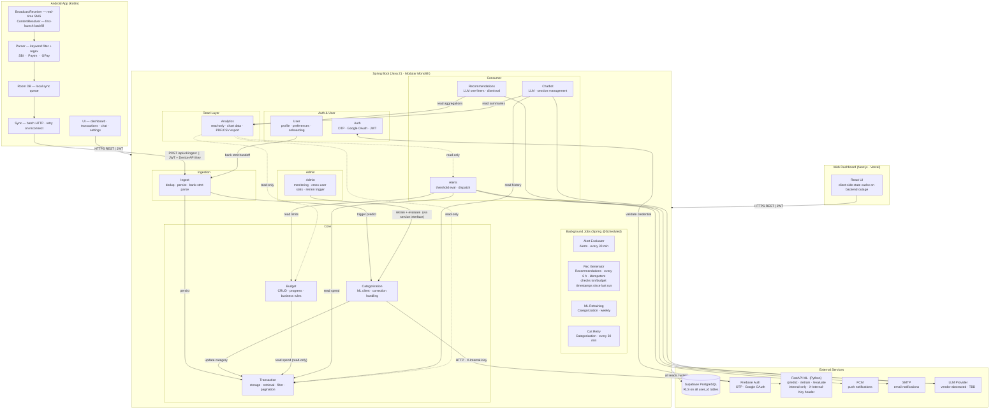

# SpendWise — System Architecture Diagram

Canonical single-page visual reference. Reflects all approved documentation. Update this diagram whenever an architectural decision is changed and approved.

> Render in VS Code with the Mermaid Preview extension, or paste into [mermaid.live](https://mermaid.live).

---

## Legend

| Style | Meaning |
| --- | --- |
| Solid arrow `-->` | Direct call via injected service interface |
| Dashed arrow `-.->` | Read-only access (Analytics module) |
| `<-->` | Bidirectional — credential validation |
| Background Jobs box | Scheduled job owned by the named module; runs module logic on a timer |

---

## Module Dependency Rules (summary)

| Module | May call |
| --- | --- |
| Ingest | Transaction, Categorization |
| Categorization | Transaction |
| Alerts | Transaction, Budget |
| Recommendations | Analytics |
| Chatbot | Transaction, Analytics |
| Analytics | All modules — read-only only |
| Admin | All modules — read; Categorization — retrain + evaluate |
| User | Ingest — bank statement handoff only |
| Auth | (no outbound calls) |
| Budget | Transaction (read-only) |

No circular dependencies. No module calls back up the ingestion chain (Ingest → Transaction → Analytics).

---

## Security Invariants

- `/api/v1/ingest` requires **both** a user JWT and a Device API Key — reject if either is missing
- FastAPI ML is **internal-only** — called exclusively by the Categorization module via `X-Internal-Key`; no other module calls FastAPI
- Admin endpoints use `ADMIN_JWT_SECRET` — a completely separate secret from `JWT_SECRET`; regular user tokens are rejected at the route level
- Supabase RLS policies enforce user data isolation at the database level for every table with a `user_id` column
- `sms_raw_text` is **never** returned in any user-facing API response — enforced via response DTOs
- Raw SMS content never travels over the network — on-device parsing only; only structured fields reach `/ingest`
