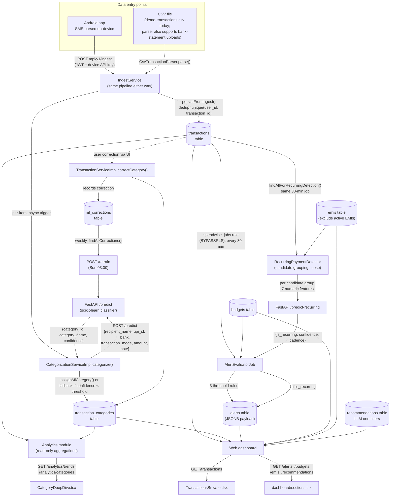

# Session Note — Data Flow Review Before Supabase Migration (2026-07-18)

**Purpose:** Ground-truth review of how transaction data enters the system, is stored, and is
consumed by the ML service, backend, and frontend — written to de-risk the Docker → Supabase
migration in progress. This traces the *actual current code*, not the spec docs, so nothing gets
missed when the connection target changes. Not a spec document; historical/reference only — if it
drifts from the code, the code wins.

## 1. End-to-end flow

## 2. Stage-by-stage field mapping

### 2a. Entry: CSV vs SMS converge on the same shape

Both paths produce an `IngestTransactionItem` before anything is persisted — this is the key fact
for migration: **there is exactly one write path into `transactions`**, so nothing about Supabase
changes this pipeline.

- **CSV** (`CsvTransactionParser.java`) — reads columns `transaction_date, debit, credit, amount,
  dr_cr_indicator, transaction_id, recipient_name, upi_id, bank, transaction_mode, note, source,
  category`. All but `category` map straight onto `IngestTransactionItem`; `category` is demo-only
  (curated override applied *after* ingest via the normal `correctCategory` path — never bypasses
  the model). `source` is always forced to `bank_statement` regardless of what the CSV says.
  Today this path is only exercised by `DemoDataSeeder` at startup, not by a real user-facing
  upload endpoint — the parser was written to support both.
- **SMS** (Android → `/api/v1/ingest`) — same `IngestTransactionItem` shape, `source` forced to
  `SMS`. Raw SMS text never leaves the phone; only structured fields are posted.
- **Dedup**: primary guard is the DB unique index `(user_id, transaction_id)`; a secondary
  in-app check also runs when `upi_id` is present (`existsBySecondaryKey`) before the insert is
  even attempted.

### 2b. Storage: `transactions` table (the one table everything else reads from)

| Column | Notes |
|---|---|
| `id` | PK, `gen_random_uuid()` |
| `user_id` | FK → `users`, RLS-scoped on every table below too |
| `transaction_date` | date-only from CSV/bank statement, date+time from SMS |
| `debit` / `credit` / `amount` | `amount` is the canonical signed field (negative=debit) everything else filters on |
| `balance` | nullable, rarely populated |
| `transaction_mode` | UPI/INB/IMPS/NEFT, nullable |
| `dr_cr_indicator` | `DR`/`CR`, enforced consistent with `amount`/`debit`/`credit` via `chk_dr_cr_consistency` |
| `transaction_id` | bank ref or synthesized hash; the dedup key |
| `recipient_name` / `upi_id` / `bank` | nullable; `upi_id` (falling back to `recipient_name`) is the **merchant-identity key** recurring detection groups on |
| `note` | nullable, mostly null in real data |
| `sms_raw_text` | **stored, never read by the app layer** — no domain model or DTO exposes it (security invariant) |
| `source` | enum `sms` / `bank_statement` / `manual` |

`transaction_categories` (1:1 with a transaction once categorized) holds `category_id`,
`confidence_score` (null if user-assigned), `assigned_by` (`ml`/`user`).

### 2c. Categorization ML — fields in flight

Request to `/predict` and `/retrain`: `recipient_name, upi_id, bank, transaction_mode, amount,
note` (+ `category_id` for retrain corrections). Response: `category_id, category_name,
confidence`. Below `ML_LOW_CONFIDENCE_THRESHOLD` (default 0.5), the transaction is assigned the
`Miscellaneous` fallback category instead of the model's answer, and stays eligible for a retry job
to re-attempt later. A user correction writes to `ml_corrections` (same six input fields +
old/new category) and becomes training data for the next weekly retrain.

### 2d. Recurring detection / Alerts — fields in flight

`RecurringPaymentDetector` reads `RecurringCandidateTransaction` rows (`user_id, transaction_id,
transaction_date, amount, upi_id, recipient_name`) via the cross-user `spendwise_jobs` role,
groups by `upi_id`/`recipient_name`, and clusters by amount tolerance + a rolling date window. Each
qualifying group is reduced to 7 numeric features (`occurrence_count, interval_mean_days,
interval_cv, amount_mean, amount_cv, span_days, days_since_last_occurrence`) sent to
`/predict-recurring`. The response (`is_recurring, confidence, cadence`) decides whether an
`alerts` row is written — everything (features, confidence, cadence, representative transaction
id) is stored in that row's JSONB `payload` column, not normalized into separate columns.

The three threshold rules (mid-month, category-overspend, category-approaching-limit) run in the
same job, reading `budgets` (`category_id, monthly_limit, month, year`) against
`sumSpendByCategoryForMonth`, and also just write `alerts` rows with a JSONB payload.

### 2e. Frontend consumption

- **`TransactionsBrowser.tsx`** — calls `GET /transactions`; reads `id, transactionDate, amount,
  recipientName, upiId, bank, categoryId` per row; posts corrections to `PUT
  /transactions/{id}/category`.
- **`CategoryDeepDive.tsx`** (analytics) — calls `GET /analytics/trends` and category-spend
  endpoints; reads `categoryId, amount, recipientName, upiId, note` (grouped by counterparty) plus
  bucketed trend series.
- **`dashboard/sections.tsx`** — calls `GET /alerts`, `/budgets`, `/emis`, `/recommendations`;
  reads each table's own columns directly (alert `type/priority/payload`, budget
  `category_id/monthly_limit`, EMI `label/amount/due_day/is_active`, recommendation
  `category_id/text/priority`).

No frontend surface ever reads `sms_raw_text` — it isn't in any DTO to read.

## 3. What this means for the Supabase migration specifically

- **Every table above is `user_id`-scoped and RLS-enforced** (`FORCE ROW LEVEL SECURITY`,
  `current_setting('app.current_user_id', true)`) — this is why the `spendwise_app` /
  `spendwise_jobs` role split matters: creating them correctly on Supabase (not connecting as the
  Supabase `postgres` superuser) is what makes the "safe-fail deny" RLS behavior real instead of
  silently bypassed. See the two `db-init/*.sql` scripts.
- **Only `AlertEvaluatorJob`, `CategorizationRetryJob`, and the retrain/recurring-retrain jobs**
  read cross-user via `spendwise_jobs` (`BYPASSRLS`) — every other read/write in the system goes
  through the RLS-scoped `spendwise_app` connection. Worth spot-checking both roles work as
  expected against Supabase before trusting the dashboard.
- **The CSV path is demo-only today** — no separate migration concern for a "user CSV upload"
  feature, since it doesn't exist yet as a user-facing endpoint; `DemoDataSeeder` reuses the exact
  same `IngestService`/`TransactionService` a real device sync would.
- **Nothing in the ML service (FastAPI) touches Postgres directly** — `MlClient` passes plain
  JSON over HTTP; the migration only affects the Spring Boot ↔ Postgres connection, not the
  Spring Boot ↔ FastAPI one.
